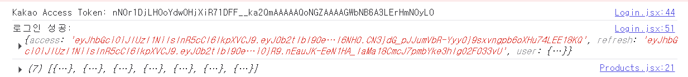

1.React 프론트엔드에서 Kakao 로그인 → Django 서버로 access_token 전달 → JWT 발급 및 로그인 처리

✅ 사용 환경: Django 4+, dj-rest-auth, allauth, djangorestframework-simplejwt


✅ 전체 흐름 요약
Kakao SDK로 로그인 → access_token 발급
그 토큰을 백엔드 /dj-rest-auth/kakao/에 POST
JWT access, refresh, user 응답
로그인 상태 Context API로 관리

✅ 필수 패키지 설치
django-allauth: 소셜 로그인을 포함한 인증 시스템을 처리하는 라이브러리
dj-rest-auth: REST API 기반 인증을 처리하는 라이브러리 (특히, JWT 인증을 사용할 때 유용)
djangorestframework: RESTful API를 만들기 위한 기본 라이브러리
requests: 카카오 API 요청을 처리하기 위한 라이브러리 (카카오 소셜 로그인 시 필요)
python-decouple: 환경 변수를 관리하기 위한 라이브러리 (API 키 등을 .env 파일로 관리)

pip install  dj-rest-auth, django-allauth, djangorestframework-simplejwt,requests,python-decouple

# 아래의 명령어를 입력 하여야함

1. DB DDL 파일 만들기
   python manage.py makemigrations

2. DDL 파일 실행
   python manage.py migrate

### 아래와 같이 토큰이 넘어오면 성공


=========================================================================================================

1. 소셜 로그인에 필요한 라이브러리 다운로드

```
pip install django-allauth
공식 사이트 : https://docs.allauth.org/en/dev/installation/quickstart.html

주 목적: 전통적인 Django 웹사이트에서 **이메일/비밀번호 로그인 + 소셜 로그인 (구글, 카카오 등)**을 지원.
UI 뷰 제공: 폼 기반의 HTML 뷰를 기본 제공.
주요 기능:
회원가입/로그인/로그아웃
이메일 인증
소셜 로그인 (OAuth2)
사용 대상: 일반적인 Django 템플릿 기반 프로젝트.
```

```
pip install dj-rest-auth
공식 사이트: https://dj-rest-auth.readthedocs.io/en/latest/index.html#
주 목적: allauth 등을 기반으로 REST API 형태의 인증 기능을 제공 (프론트엔드는 React, Vue 등에서 사용).
API 제공: JSON 기반 API (/login/, /logout/, /register/, /password/reset/ 등).
주요 기능:
로그인 / 로그아웃 (Token 또는 JWT 방식)
회원가입
비밀번호 변경/재설정
이메일 인증 (선택)
소셜 로그인 연동 가능 (with allauth)
사용 대상: Django를 백엔드 API 서버로 사용하는 경우.
```

2. dj-rest-auth + allauth로 REST API 형태의 카카오 로그인 API 구축 가능.

```
====== 왜 refresh token 만 thhp only 로 하는가 =============
✅ 전제: JWT 인증 구조
JWT 인증 시스템은 보통 아래처럼 구성됩니다:

access_token (짧은 수명, 예: 5분)

refresh_token (긴 수명, 예: 7일)

✅ 왜 refresh_token만 HttpOnly로 할까?
🔐 1. 보안 강화 (XSS 방어)
refresh_token은 탈취되면 오랫동안 새 access_token을 발급받을 수 있음

그래서 무조건 HttpOnly로 설정해서 JS로 절대 접근 못 하게 막음
→ XSS 공격으로도 훔칠 수 없음 ✅

🧠 2. access_token은 JS에서 필요함
access_token은 React 앱에서 API 요청에 직접 사용 (Authorization 헤더)

따라서 JS에서 access_token은 읽을 수 있어야 함

js
복사
편집
axios.get("/api/profile/", {
  headers: {
    Authorization: `Bearer ${accessToken}`
  }
});
이 토큰이 HttpOnly면 JS로 접근 못 해서 API 호출 자체가 안 됨

🔁 리프레시 흐름 요약
로그인하면:

access_token: JS에서 저장 (예: 메모리, localStorage, etc.)

refresh_token: HttpOnly 쿠키로 저장 (서버만 접근 가능)

access_token 만료 시:

React가 API 요청 → 401 Unauthorized

→ refresh_token으로 silent re-login (자동 재발급 요청)

→ 서버가 refresh_token 쿠키 보고 새 access_token 발급

✅ 이렇게 하면 얻는 장점
전략	효과
refresh_token → HttpOnly	탈취 방지 (보안 ↑)
access_token → JS 접근 가능	API 요청 가능 (유연성 ↑)
refresh 실패 시 로그아웃	자동 로그아웃 처리 가능

🔐 보안 요약
토큰	저장 위치	HttpOnly	사용 목적
access_token	JS (메모리 등)	❌	API 요청 인증
refresh_token	HttpOnly 쿠키	✅	access_token 재발급용

```