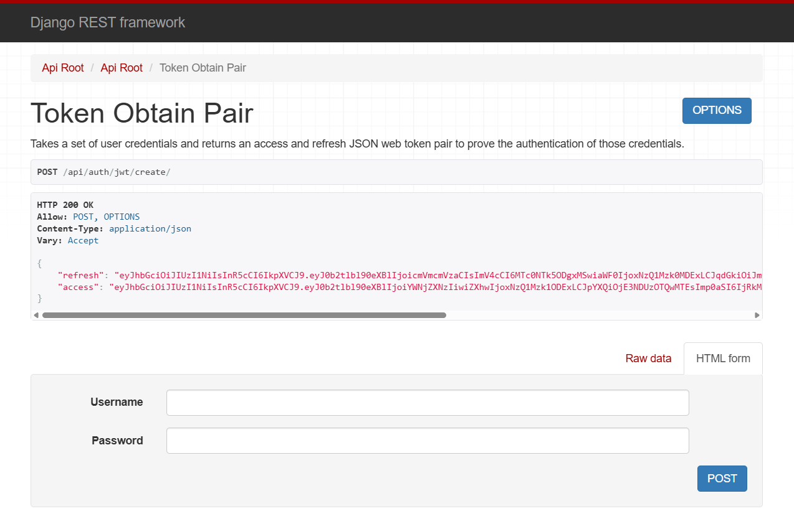

1. 아래의 두개를 install 한다.

pip install -U djoser
pip install -U djangorestframework_simplejwt

2. 생성되는 URL
✅ djoser.urls (/auth/ 아래에 생성되는 URL)

메서드	경로	설명
POST	/auth/users/	회원가입
GET	    /auth/users/me/	현재 로그인된 유저 정보
POST	/auth/users/resend_activation/	활성화 이메일 재전송 (선택)
POST	/auth/users/activation/	계정 활성화 (선택)
POST	/auth/users/set_password/	비밀번호 변경 (로그인 상태)
POST	/auth/users/reset_password/	비밀번호 재설정 이메일 전송
POST	/auth/users/reset_password_confirm/	비밀번호 재설정 확인
POST	/auth/token/login/	세션 로그인 (Token 기반 인증 사용 시)
POST	/auth/token/logout/	세션 로그아웃 (Token 기반 인증 사용 시)

✅ djoser.urls.jwt (/auth/jwt/ 아래에 생성되는 URL)

메서드	경로	설명
POST	/auth/jwt/create/	JWT 로그인 (access + refresh 발급)
POST	/auth/jwt/refresh/	access 토큰 재발급
POST	/auth/jwt/verify/	토큰 유효성 검사
POST	/auth/jwt/logout/	로그아웃 (refresh 토큰 블랙리스트 처리)

2. 설정후 아래와 같이 테스트
{
    "username": "test100",
    "email": "test@test100.com",
    "password": "1234",
    "gender": "M",
    "job": "S",
    "old_cart": ""
}

# 🔐 주요 엔드포인트 예시
# 경로	설명
# POST /auth/jwt/create/	로그인 (토큰 발급)
# POST /auth/jwt/refresh/	액세스 토큰 갱신
# POST /auth/jwt/verify/	토큰 유효성 확인
# POST /auth/users/	회원가입
# GET /auth/users/me/	현재 로그인된 사용자 조회

http://127.0.0.1:8000/api/auth/jwt/create/

참고 문헌)
1.https://velog.io/@kungsboy/65.Django%EC%9E%A5%EA%B3%A0-ecommerce-%ED%94%84%EB%A1%9C%EC%A0%9D%ED%8A%B8-DRF-%EC%9C%A0%EC%A0%80%EA%B0%80%EC%9E%85-%EB%A1%9C%EA%B7%B8%EC%9D%B8-Access-Token-%EB%B0%8F-RefreshToken
