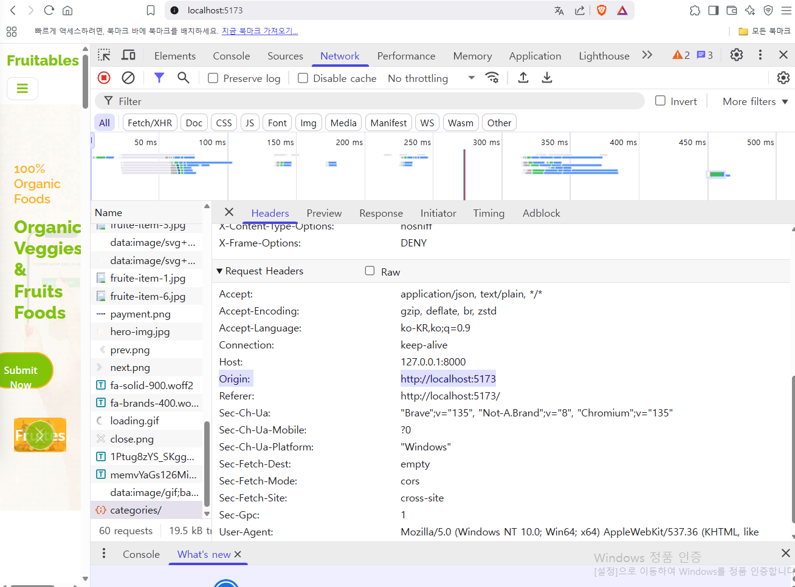

1. 장바구니 구조 설계
https://chatgpt.com/c/680873bf-67fc-8007-b7d1-08ebcbb344d4

    //✅ [name]: value는?
    // 동적 키 설정입니다.
    // name이라는 변수에 들어있는 값이 키 이름이 됩니다.
    // 예를 들어 name = "address" 라면, { [name]: value }는 { address: value }와 같습니다.
    // const name = "city";
    // const value = "서울";
    // const obj = { [name]: value }; // { city: "서울" }
    /////////////////////////////////////////////////////////////
    //prev = { address: "서울", city: "부산" }
    // name = "city"
    // value = "대구"
    // => 결과: { address: "서울", city: "대구" }

    const obj = { [name]: value }는 ES6의 객체 리터럴 문법 중 "계산된 속성명(computed property name)" 기능이야.

    //기존에는 객체의 key를 만들 때 문자열 리터럴로만 가능했지만
    const obj = {
        city: "서울" // key가 고정됨
    };
    //ES6부터는 변수를 key로 사용할 수 있게 되었음
    const name = "city";
    const value = "서울";
       
    const obj = {
    [name]: value  // → { city: "서울" }
    };

    [name] => 계산된 속성명 임
    
https://chatgpt.com/c/680873bf-67fc-8007-b7d1-08ebcbb344d4